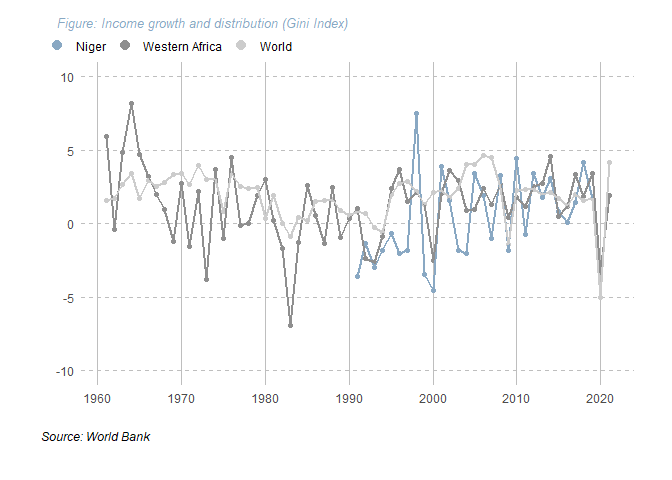
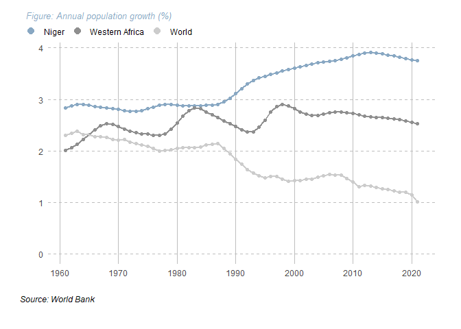
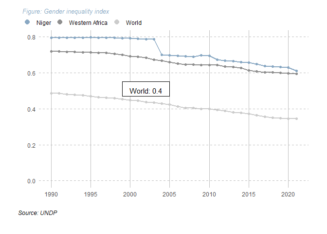

# Importation des packages nécessaires et préparation de l'environnement R


```r
library(tidyverse)
library(dplyr)
library(here)
library(ggplot2)
library(ggtext)
```


```r
rm(list=ls())
```


```r
c_dir <- paste0(here::here(), "/TP_3_ALAGBE_AbdouHamid")
setwd(c_dir)
```


# Importation des bases de données


```r
pop_growth_annual <- read_csv(
  paste0(c_dir, "/data/population-growth-annual.csv"))
gender_inequality_index <- read_csv(
  paste0(c_dir, "/data/gender-inequality-index.csv"))
annual_growth_in_gni_per_capita <- read_csv(
  paste0(c_dir, "/data/annual-growth-in-gni-per-capita.csv"))
```

# Graphics reproduction


```r
# Niger dataset

niger_annual_growth_in_gni_per_capita <- 
  filter(annual_growth_in_gni_per_capita, `Region Name` == "Niger")
niger_annual_growth_in_gni_per_capita <- 
  select(niger_annual_growth_in_gni_per_capita, 
  c("Start Year", "Value"))
niger_annual_growth_in_gni_per_capita$Region <- "Niger"
```


```r
# Western dataset

western_africa_annual_growth_in_gni_per_capita <- 
  aggregate(`Value` ~ `Region Name`+`Start Year`,                                                          annual_growth_in_gni_per_capita[
    annual_growth_in_gni_per_capita$`Region Name` %in% 
      c("Benin", "Burkina Faso", "Cabo Verde",
        "Gambia", "Ghana", "Guinea", "Guinea-Bissau",
        "Côte d’Ivoire", "Liberia", "Mali",
        "Mauritania", "Niger", "Nigeria", "Senegal",
        "Sierra Leone", "Togo"), ],
    FUN=sum)

western_africa_annual_growth_in_gni_per_capita <- 
  aggregate(`Value` ~ `Start Year`,
            western_africa_annual_growth_in_gni_per_capita,
            FUN=mean)

western_africa_annual_growth_in_gni_per_capita$Region <- "Western Africa"
```


```r
# World dataset

world_annual_growth_in_gni_per_capita <- 
  aggregate(`Value` ~ `Region Name`+`Start Year`,
            annual_growth_in_gni_per_capita,
            FUN=sum)

world_annual_growth_in_gni_per_capita <- 
  aggregate(`Value` ~ `Start Year`,
            world_annual_growth_in_gni_per_capita,
            FUN=mean)

world_annual_growth_in_gni_per_capita$Region <- "World"
```


```r
# Final dataset for plotting

plot_annual_growth_in_gni_per_capita <- 
  rbind(niger_annual_growth_in_gni_per_capita,
        western_africa_annual_growth_in_gni_per_capita,
        world_annual_growth_in_gni_per_capita)
```


```r
plot <- 
  ggplot(plot_annual_growth_in_gni_per_capita, 
         aes(`Start Year`, `Value`, group=`Region`)) +
  scale_x_continuous(breaks = seq(1960, 2020, 10)) +  
  # Adjust x-axis ticks
  scale_y_continuous(limits = c(-10, 10)) +
  # Adjust y-axis
  geom_point(size=1.5) +
  theme_minimal() +
  theme(
    legend.position = "top",  # Move legend to the top
    legend.justification = "left",  # Justify legend to the left
    )

plot <- plot +
  geom_point(aes(color=`Region`)) +
  geom_line(aes(color=`Region`), size=0.9) +
  scale_color_manual(
    values = c("#89A8C3", "#8F8F8F", "#CCCCCC"), 
    guide=guide_legend(
      title = NULL,
      override.aes = list(size = 3.25, linetype = "blank"))) +
  ggtitle(
    expression(
      italic("Figure: Income growth and distribution (Gini Index)"))) +
  labs(colour = "",
       x="",
       y="",
       caption = "Source: World Bank") +
  theme(plot.title = element_text(
    color = "#89A8C3", face = "italic",
    size=10, vjust = 8, hjust = -0.09),
    plot.caption = element_text(face = "italic", hjust = -0.09),
    panel.grid.major.x = element_line(
      colour = "grey",
      size = 0.1, 
      linetype = "solid"),
    panel.grid.minor.x = element_blank(),
    legend.position = c(-0.09, 1.05),
    legend.direction="horizontal",
    panel.grid.major.y = element_line(
      colour = "grey",
      size = 0.1, 
      linetype = "dashed"),
      # Supprime les lignes de grille secondaires
    panel.grid.minor.y = element_blank(),
    plot.margin = margin(1, 1, 1, 1, "cm"))

plot
```

<!-- -->


```r
table(pop_growth_annual$`Region Name`)
length(unique(pop_growth_annual$`Region Name`))
```


```r
# Niger dataset

niger_pop_growth_annual <- 
  filter(pop_growth_annual, `Region Name` == "Niger")
niger_pop_growth_annual <- 
  select(niger_pop_growth_annual, c("Start Year", "Value"))
niger_pop_growth_annual$Region <- "Niger"
```


```r
# Western dataset

western_africa_pop_growth_annual <- 
  aggregate(`Value` ~ `Region Name`+`Start Year`,
            pop_growth_annual[
              pop_growth_annual$`Region Name` %in% 
                c("Benin", "Burkina Faso", "Cabo Verde",
                  "Gambia", "Ghana", "Guinea", "Guinea-Bissau",
                  "Côte d’Ivoire", "Liberia", "Mali",
                  "Mauritania", "Niger", "Nigeria", "Senegal",
                  "Sierra Leone", "Togo"), ],
            FUN=sum)

western_africa_pop_growth_annual <- 
  aggregate(`Value` ~ `Start Year`,
            western_africa_pop_growth_annual,
            FUN=mean)

western_africa_pop_growth_annual$Region <- "Western Africa"
```


```r
# World dataset

world_pop_growth_annual <- 
  aggregate(`Value` ~ `Region Name`+`Start Year`,
            pop_growth_annual,
            FUN=sum)

world_pop_growth_annual <- 
  aggregate(`Value` ~ `Start Year`,
            world_pop_growth_annual,
            FUN=mean)

world_pop_growth_annual$Region <- "World"
```


```r
# Final dataset for plotting

plot_pop_growth_annual <- 
  rbind(niger_pop_growth_annual,
        western_africa_pop_growth_annual,
        world_pop_growth_annual)
```


```r
plot <- 
  ggplot(plot_pop_growth_annual,
         aes(`Start Year`, `Value`, group=`Region`)) +
  scale_x_continuous(breaks = seq(1960, 2020, 10)) + 
  # Adjust x-axis ticks
  scale_y_continuous(
    limits = c(0, NA),
    breaks = seq(0, ceiling(max(plot_pop_growth_annual$Value)), 1)) +
  # Adjust y-axis
  geom_point(size=1.5) +
  theme_minimal() +
  theme(
    legend.position = "top",  # Move legend to the top
    legend.justification = "left",  # Justify legend to the left
    )

plot <- plot +
  geom_point(aes(color=`Region`)) +
  geom_line(aes(color=`Region`), size=0.9) +
  scale_color_manual(
    values = c("#89A8C3", "#8F8F8F", "#CCCCCC"), 
    guide=guide_legend(
    title = NULL,
    override.aes = list(size = 3.25, linetype = "blank"))) +
  ggtitle(
    expression(
      italic("Figure: Annual population growth (%)"))) +
  labs(colour = "",
       x="",
       y="",
       caption = "Source: World Bank") +
  theme(
    plot.title = element_text(
      color = "#89A8C3", face = "italic",
      size=10, vjust = 8, hjust = -0.09),
    plot.caption = element_text(face = "italic", hjust = -0.09),
    panel.grid.major.x = element_line(
      colour = "grey",
      size = 0.1, linetype = "solid"),
    panel.grid.minor.x = element_blank(),
    legend.position = c(-0.09, 1.05),
    legend.direction="horizontal",
    panel.grid.major.y = element_line(
      colour = "grey",
      size = 0.1, 
      linetype = "dashed"),
    # Supprime les lignes de grille secondaires
    panel.grid.minor.y = element_blank(),
    plot.margin = margin(1, 1, 1, 1, "cm"))

plot
```

<!-- -->


```r
# Niger dataset

niger_gender_inequality_index <- 
  filter(gender_inequality_index, `Region Name` == "Niger")
niger_gender_inequality_index <- 
  select(niger_gender_inequality_index, c("Start Year", "Value"))
niger_gender_inequality_index$Region <- "Niger"
```


```r
# Western dataset

western_africa_gender_inequality_index <- 
  aggregate(
    `Value` ~ `Region Name`+`Start Year`,
    gender_inequality_index[
      gender_inequality_index$`Region Name`  %in% 
        c("Benin", "Burkina Faso", "Cabo Verde",
          "Gambia", "Ghana", "Guinea", "Guinea-Bissau",
          "Côte d’Ivoire", "Liberia", "Mali",
          "Mauritania", "Niger", "Nigeria", "Senegal",
          "Sierra Leone", "Togo"), ],
    FUN=sum)

western_africa_gender_inequality_index <- 
  aggregate(
    `Value` ~ `Start Year`,
    western_africa_gender_inequality_index,
    FUN=mean)

western_africa_gender_inequality_index$Region <- "Western Africa"
```


```r
# World dataset

world_gender_inequality_index <- 
  aggregate(
    `Value` ~ `Region Name`+`Start Year`,
    gender_inequality_index,
    FUN=sum)

world_gender_inequality_index <- 
  aggregate(
    `Value` ~ `Start Year`,
    world_gender_inequality_index,
    FUN=mean)

world_gender_inequality_index$Region <- "World"
```


```r
# Final dataset for plotting

plot_gender_inequality_index <- 
  rbind(niger_gender_inequality_index, 
        western_africa_gender_inequality_index,
        world_gender_inequality_index)
```


```r
plot <- 
  ggplot(plot_gender_inequality_index,
         aes(`Start Year`, `Value`, group=`Region`)) +
  scale_x_continuous(breaks = seq(1990, 2020, 5)) +  
  # Adjust x-axis ticks
  scale_y_continuous(
    limits = c(0, NA), 
    breaks = seq(
      0, 
      ceiling(max(plot_gender_inequality_index$Value)),
      0.2)) +# Adjust y-axis
  geom_point(size=1.5) +
  theme_minimal() +
  theme(
    legend.position = "top",  # Move legend to the top
    legend.justification = "left",  # Justify legend to the left
    )

plot <- plot +
  geom_point(aes(color=`Region`)) +
  geom_line(aes(color=`Region`), size=0.9) +
  scale_color_manual(
    values = c("#89A8C3", "#8F8F8F", "#CCCCCC"),
    guide=guide_legend(
    title = NULL,
    override.aes = 
      list(size = 3.25, linetype = "blank"))) +
  ggtitle(
    expression(
      italic("Figure: Gender inequality index"))) +
  labs(colour = "",
       x="",
       y="",
       caption = "Source: UNDP") +
  theme(
    plot.title = element_text(
      color = "#89A8C3", face = "italic",
      size=10, vjust = 8, hjust = -0.09),
    plot.caption = element_text(face = "italic", hjust = -0.09),
    panel.grid.major.x = element_line(
      colour = "grey",
      size = 0.1, linetype = "solid"),
    panel.grid.minor.x = element_blank(),
    legend.position = c(-0.09, 1.05),
    legend.direction="horizontal",
    panel.grid.major.y = element_line(
      colour = "grey",
      size = 0.1, 
      linetype = "dashed"),
    # Supprime les lignes de grille secondaires
    panel.grid.minor.y = element_blank(),
    plot.margin = margin(1, 1, 1, 1, "cm"))

plot <- plot +
  annotate(
    "rect", 
    xmin = 1999, 
    xmax = 2005, 
    ymin = 0.47, 
    ymax = 0.55, 
    fill = "white",
    color = "black", 
    size = 0.5) +
  geom_text(
    data = subset(
      plot_gender_inequality_index, 
      `Region` == "World" & `Start Year` == 2002),
    aes(
      label = paste(
        `Region`, ": ", round(`Value`, digits = 1), sep = "")),
    vjust = -1.5, hjust = 0.5)

plot
```

<!-- -->


